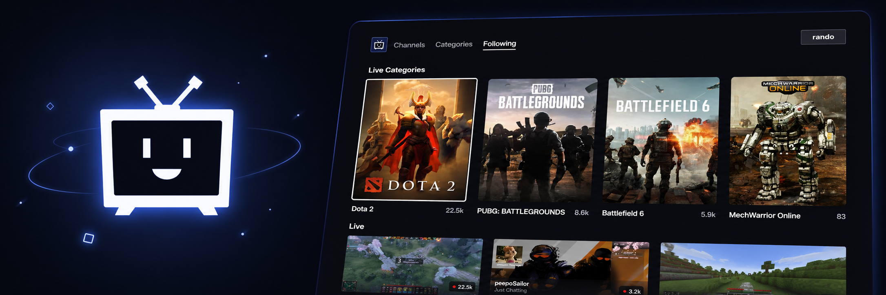

<p align="center">
  
</p>

<h1 align="center">Twellie</h1>
<p align="center">
  <b>Independent TV client for watching Twitch streams on supported Samsung Smart TV platforms.</b><br />
  Built for older or unsupported devices, remote-friendly navigation, and a lightweight TV experience.
</p>

<p align="center">
  Twellie is an independent, unofficial project. It is not affiliated with, endorsed by, sponsored by, or associated with Twitch Interactive, Amazon, or Samsung.
</p>

<p align="center">
  <a href="/nkatchik/smarttv-twitch/actions/workflows/ci.yml"></a>
  <a href="https://nkatchik.github.io/smarttv-twitch/"></a>
  <a href="LICENSE"></a>
  
  
</p>

## Why Twellie?

- Independent and unofficial, with no claim of platform affiliation or app-store approval.
- Lightweight ES5 codebase for old TV engines and modern browser-based harnesses.
- Remote-first browsing, playback, quality selection, chat, VODs, and clips.
- TV builds do not require a Twellie backend service; playback and browse requests are handled by the app and platform player.
- Supports Orsay, Tizen, TizenBrew, and browser preview builds where the platform capabilities are available.
- Localized UI for 12 languages.

## Install on Your TV

Pick the guide that matches your TV generation and preferred install method. TV firmware, region, and developer-mode behavior vary, so these are supported paths rather than a promise that every model works.

| TV Model | Platform | Installation |
| - | - | - |
| **2013 F-series** | Orsay | 📦 [macOS](docs/install/orsay-f-2013-macos.md) · 📦 [Windows](docs/install/orsay-f-2013-windows.md) |
| **2014 H-series** | Orsay | 📦 [macOS](docs/install/orsay-h-2014-macos.md) · 📦 [Windows](docs/install/orsay-h-2014-windows.md) |
| **2015+ J-series and newer** | Tizen | 📦 [Apps2Samsung](docs/install/apps2samsung.md) |
| **2017+ M-series and newer** | Tizen | 📦 [TizenBrew GitHub module](docs/install/tizenbrew.md) |

Older 2011-2012 D/E Orsay sets are not supported. See [docs/PLATFORMS.md](docs/PLATFORMS.md) for engine details, playback paths, and current caveats.

## Compatibility

| Bucket | What it means for Twellie |
| --- | --- |
| Confirmed/tested | Build and install paths covered by this repo: Orsay F/H App Sync installers, Tizen `.wgt` release packaging, TizenBrew packaging, and the browser harness. |
| Likely but untested | Additional Tizen model years that expose the expected AVPlay, web runtime, developer-mode, and network behavior. Please report model-specific results. |
| Unsupported | 2011-2012 D/E Orsay sets, TVs whose firmware cannot reach modern Twitch HTTPS endpoints, and devices without a usable install path. |
| Unknown | Regional firmware variants, newer platform changes, and third-party browser environments not covered by the current reports. |

When reporting compatibility, include the TV model, model year if known, platform, firmware/software version, install method, what works, what fails, and safe logs or screenshots.

## Project status

Twellie 4.0 is a major refactor/release of a project that began in 2014. The current app has a shared ES5 core, platform adapters for Orsay/Tizen/TizenBrew/web, refreshed Twitch playback/browse integration, chat, VODs/clips, login for followed channels on supported builds, release packaging, and unit tests.

The project is community-maintained. Contributions, device test reports, compatibility reports, and focused bug reports are welcome.

## Legal

Twellie is an independent, unofficial project. It is not affiliated with, endorsed by, sponsored by, or associated with Twitch Interactive, Amazon, or Samsung.

Third-party names are used only to describe compatibility and the service Twellie connects to. Do not submit third-party logos, copied app-store assets, copyrighted stream screenshots, channel content, or brand-styled marketing assets unless you have the rights to include them.

## Credits and heritage

Born in 2014 and shaped by a decade of community pull requests: translations, compatibility fixes, and device-specific improvements from contributors.

## Contributing

PRs welcome. Keep the TV code ES5 and include device details for platform-specific changes.

```sh
npm run lint
npm test
npm start
```
